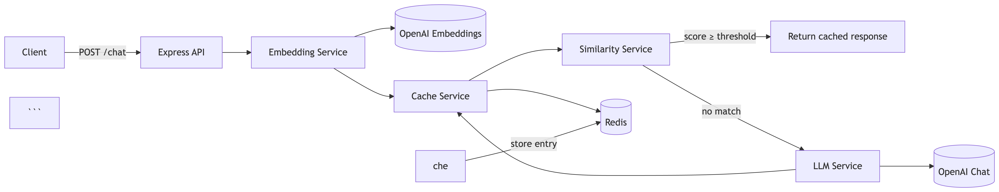

# SemanticCacheJS

A production-ready semantic caching library for OpenAI, Anthropic, Gemini, and other LLM providers.

Reduce repeated LLM calls, cut token costs, and lower latency by caching responses by **meaning** — not exact string match.

## Why SemanticCacheJS

Most semantic cache demos only return a hit/miss boolean. SemanticCacheJS returns useful cache metadata so you can observe and debug production traffic:

```json
{
  "cached": true,
  "similarity": 0.94,
  "latency": "42ms",
  "provider": "redis",
  "response": "..."
}
```

| Field | Meaning |
|---|---|
| `cached` | Whether the response came from cache |
| `similarity` | Cosine similarity of the best match (`null` on miss) |
| `latency` | End-to-end request time |
| `provider` | `redis` on hit, `openai` on miss (more providers coming) |
| `response` | Cached or freshly generated answer |

## Architecture



**Request flow**

1. Client sends a prompt to `POST /chat`
2. Embedding service turns the prompt into a vector
3. Cache service loads entries from Redis; similarity service finds the best cosine match
4. **Hit** — return cached response + metadata (`provider: "redis"`)
5. **Miss** — call the LLM, store `{prompt, embedding, response}`, return fresh response + metadata

## Project layout

```
semantic-cache/
├── src/                 # Core Express demo + services
├── examples/            # Framework integrations (growing)
│   ├── express/
│   ├── fastify/
│   ├── nextjs/
│   └── nestjs/
├── docs/                # Guides and design notes
├── benchmark/           # Latency / hit-rate benchmarks
├── tests/               # Unit and integration tests
├── docker-compose.yml
└── README.md
```

## Quick start

```bash
cp .env.example .env
# set OPENAI_API_KEY in .env

docker compose up -d
npm install
npm run dev
```

## Try it

```bash
curl -s http://localhost:3000/chat \
  -H 'Content-Type: application/json' \
  -d '{"prompt":"What is semantic caching?"}'
```

A second, similarly worded prompt should return `"cached": true` with similarity ≥ `SIMILARITY_THRESHOLD` (default `0.92`) and a much lower `latency`.

```bash
npm test
```

## Tech stack (v1)

- Node.js + Express
- Redis
- OpenAI Embeddings + Chat
- Cosine similarity

## Roadmap

| Version | Focus |
|---|---|
| **v1** | Semantic cache (Express + Redis + OpenAI) |
| **v2** | Redis Vector Search |
| **v3** | Qdrant support |
| **v4** | Pinecone support |
| **v5** | Observability & metrics |
| **v6** | Express middleware package |
| **v7** | LangGraph integration |
| **v8** | Multi-tenant support |

Also planned: Anthropic / Gemini providers, Fastify / Next.js / NestJS examples, and publishable npm API (`npm install semantic-cache-js`).

## License

MIT
